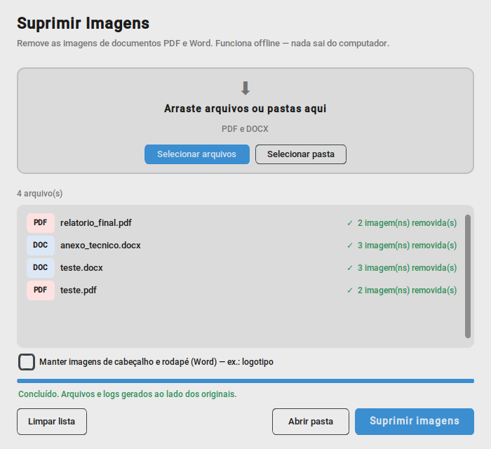

# Suprimir Imagens

Ferramenta simples para **remover todas as imagens de documentos PDF e Word (.docx)**, mantendo o texto e a diagramação.

Cada imagem é substituída por uma caixa cinza com o texto `[IMAGEM SUPRIMIDA]`. O arquivo original nunca é alterado — uma cópia limpa é gerada ao lado dele.

Útil para gerar versões mais leves de documentos, versões só-texto para revisão ou para compartilhar documentos sem as imagens.

## Características

- **Funciona 100% offline** — nenhum dado é enviado para a internet.
- **Remoção real**: a imagem é excluída do arquivo, não apenas coberta.
- Remove também miniaturas de página, anexos embutidos, metadados XMP e objetos incorporados.
- **Verificação automática**: após gerar o arquivo, confere se nenhuma imagem permaneceu.
- Gera um **log** com hash SHA-256 do original e do arquivo gerado.
- Processa arquivos individuais ou pastas inteiras.

## Download

Baixe o `SuprimirImagens.exe` na aba **Actions** (execução mais recente → *Artifacts*) ou em **Releases**, quando disponível. Não precisa instalar nada.

## Como usar



1. Abra o `SuprimirImagens.exe`.
2. Arraste arquivos ou pastas para a janela — ou use **Selecionar arquivos** / **Selecionar pasta**.
3. Clique em **Suprimir imagens**.
4. Cada arquivo mostra o resultado ao lado. **Abrir pasta** leva direto aos arquivos gerados.

A opção *Manter imagens de cabeçalho e rodapé* (somente Word) preserva logotipos do cabeçalho.

Também é possível arrastar arquivos diretamente sobre o ícone do `.exe`: a janela abre com eles já na lista.

## Arquivos gerados

| Arquivo | Conteúdo |
|---|---|
| `nome_SEM_IMAGENS.pdf` / `.docx` | Cópia do documento sem as imagens |
| `nome_SEM_IMAGENS_log.txt` | Data/hora, hashes SHA-256, quantidade de imagens removidas e resultado da verificação |

Se a verificação indicar **FALHOU**, o arquivo gerado ainda contém imagens e não deve ser usado.

## Formatos suportados

- PDF (não protegido por senha)
- Word `.docx` (arquivos `.doc` antigos devem ser salvos como `.docx` antes)

## Rodar a partir do código-fonte

```
pip install pymupdf lxml customtkinter tkinterdnd2
python suprimir_imagens.py
```

## Gerar o executável

O `.exe` é gerado automaticamente pelo GitHub Actions a cada atualização na branch `main`. Para gerar localmente em um Windows com Python:

```
pip install pymupdf lxml customtkinter tkinterdnd2 pyinstaller
python -m PyInstaller --onefile --windowed --name SuprimirImagens --collect-all customtkinter --collect-all tkinterdnd2 suprimir_imagens.py
```

## Licença

Distribuído sob a licença **AGPL-3.0**, em conformidade com a licença da biblioteca [PyMuPDF](https://github.com/pymupdf/PyMuPDF) utilizada no projeto.
